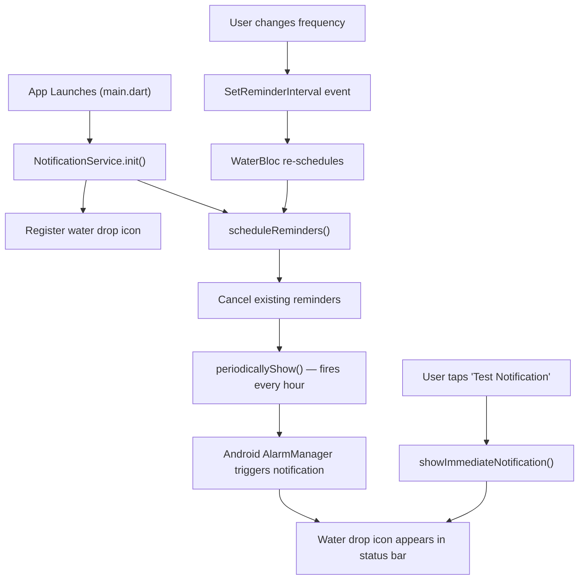
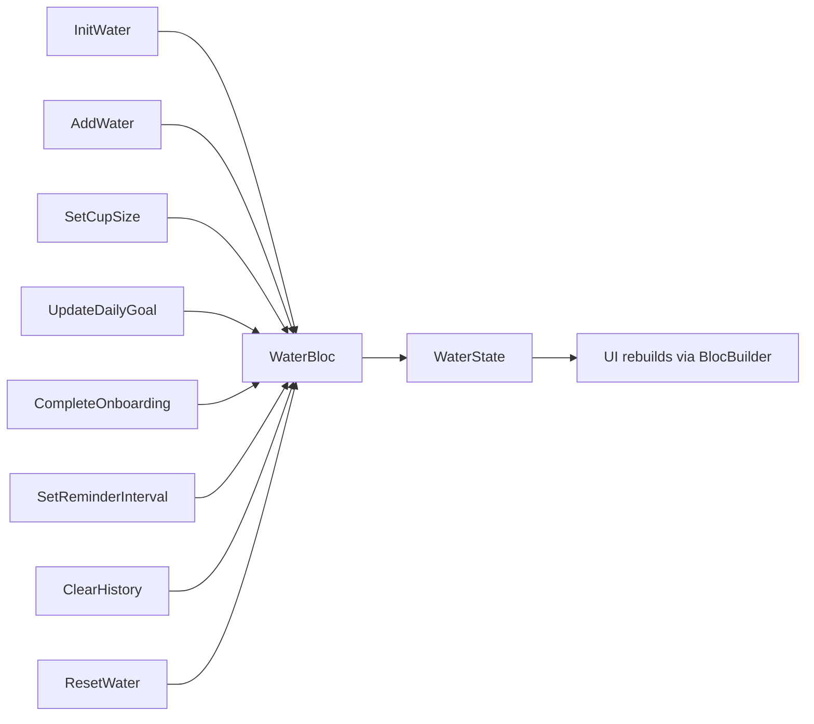

# WaterTrack — App Documentation

## Overview

A **Flutter** app that reminds users to drink water based on their body metrics. It calculates a personalized daily goal from weight and height, tracks intake with animated UI, and sends periodic notifications.

---

## Tech Stack

| Layer | Technology |
|---|---|
| Framework | Flutter (Dart) |
| State Management | `flutter_bloc` + `equatable` |
| Local Storage | `hive` + `hive_flutter` |
| Notifications | `flutter_local_notifications` |
| Date Formatting | `intl` |

---

## Project Structure

```
lib/
├── main.dart                          # App entry point, Bloc & Hive init
├── core/
│   └── services/
│       └── notification_service.dart  # All notification logic
├── features/
│   └── water/
│       ├── bloc/
│       │   ├── water_bloc.dart        # Business logic
│       │   ├── water_event.dart       # Events (AddWater, SetGoal, etc.)
│       │   └── water_state.dart       # State (intake, goal, metrics)
│       ├── model/
│       │   └── water_model.dart       # Hive data model
│       └── screens/
│           ├── onboarding_screen.dart # First-launch metrics collection
│           ├── home_screen.dart       # Main dashboard + wave animation
│           ├── history_screen.dart    # Past 7 days intake log
│           └── settings_screen.dart   # Goal, reminders, data management
```

---

## 🔔 Notification System — How It Works

### Plugin Used
[`flutter_local_notifications`](https://pub.dev/packages/flutter_local_notifications) — a Flutter plugin that bridges Dart code to **native Android/iOS notification APIs**.

### Flow Diagram



### Key Files

#### [notification_service.dart](file:///home/brindaponkiya/Desktop/Flutter/smart_task/lib/core/services/notification_service.dart)

| Method | Purpose |
|---|---|
| `init()` | Initializes the plugin with the water drop icon (`@mipmap/launcher_icon`) |
| `scheduleReminders()` | Cancels old reminders, then schedules periodic notifications using `periodicallyShow()` |
| `showImmediateNotification()` | Fires a one-time test notification instantly |
| `cancelAll()` | Stops all scheduled notifications |

### Android-Specific Setup

In [AndroidManifest.xml](file:///home/brindaponkiya/Desktop/Flutter/smart_task/android/app/src/main/AndroidManifest.xml):

- **Permissions**: `POST_NOTIFICATIONS`, `SCHEDULE_EXACT_ALARM`, `WAKE_LOCK`, `RECEIVE_BOOT_COMPLETED`
- **Receivers**: `ScheduledNotificationReceiver` and `ScheduledNotificationBootReceiver` — these ensure notifications survive device reboots
- **Core Library Desugaring**: Required in `build.gradle.kts` for Java 8+ APIs used by the plugin

### iOS-Specific Setup

In [Info.plist](file:///home/brindaponkiya/Desktop/Flutter/smart_task/ios/Runner/Info.plist):
- `NSLocalNotificationsUsageDescription` — explains to the user why notifications are needed

---

## 📱 App Features

### 1. Onboarding
- Collects **weight** (kg) and **height** (cm) on first launch
- Calculates daily goal: `weight × 35ml`
- Saved to Hive `settings_box`

### 2. Home Screen
- Animated wave progress circle (tap to add water)
- Quick cup size selector (100ml–400ml + custom)
- Real-time progress percentage

### 3. History
- Last 7 days intake log with progress bars
- Empty state UI when no data exists

### 4. Settings
- Edit daily goal manually
- Update weight/height (recalculates goal)
- Change reminder frequency (1–6 hours)
- Test notification button
- Clear all data

---

## 🧱 State Management (Bloc)

### Events → Bloc → State



### State Properties
`todayIntake`, `dailyGoal`, `selectedCupSize`, `reminderHours`, `weight`, `height`, `onboardingCompleted`, `history`

---

## 💾 Data Persistence (Hive)

| Box | Purpose |
|---|---|
| `water_box` | Daily intake records (`WaterModel` — date, intake, goal) |
| `settings_box` | User preferences (weight, height, goal, reminder interval, onboarding status) |
